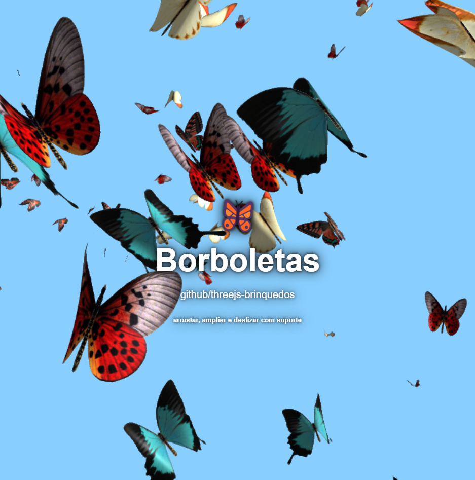
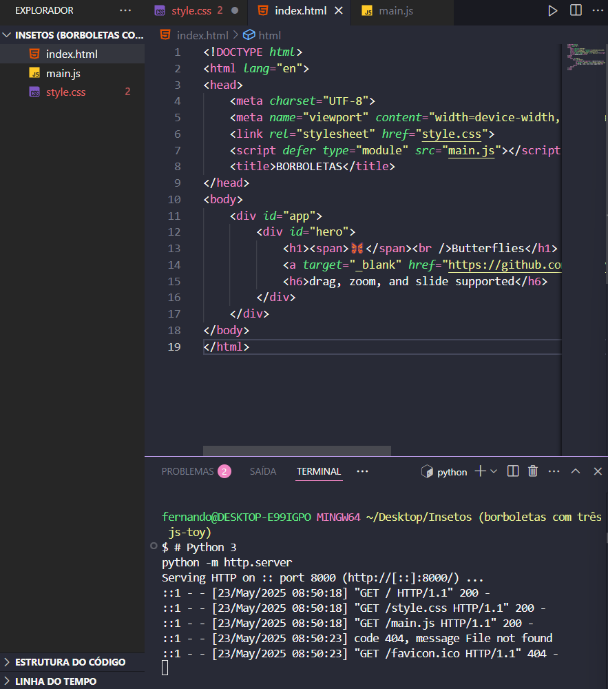

🎯 Objetivo do Projeto
Criar um plano de fundo visualmente impressionante onde centenas de borboletas virtuais voam de forma natural, reagindo ao movimento e interação do usuário (como arrastar, dar zoom ou deslizar).

🦋 O que exatamente acontece quando você abre o projeto:
Uma animação 3D é carregada:

Diversas borboletas são renderizadas em tempo real com WebGL via Three.js e a biblioteca threejs-toys.

Essas borboletas têm asas animadas:

Elas batem as asas com uma animação suave e realista (via simulação de GPU com GPGPU).

O plano de fundo tem profundidade e iluminação realistas:

A luz ambiente e direcional cria sombras e reflexos nas asas das borboletas (material tipo phong).

Isso dá a sensação de volume e tridimensionalidade.

Interações do usuário são detectadas:

O usuário pode:

Arrastar o fundo com o mouse ou dedo (drag).

Aproximar ou afastar (zoom) com o scroll.

Mudar o ponto de vista (slide).

As borboletas respondem ao movimento como se estivessem vivas e explorando o espaço.

Textura das asas é aplicada:

Um sprite com diferentes formas de asas é carregado da internet e usado para diferenciar visualmente os insetos.

🧠 Por trás dos panos (conceitos avançados usados):
Conceito	Função
Three.js	Biblioteca que renderiza gráficos 3D no navegador usando WebGL
GPGPU	Usa o poder da GPU para simular o comportamento físico de centenas de objetos (como movimento das borboletas)
Simulação de partículas	Cada borboleta é uma partícula com regras próprias de movimento
Importação ES6 via CDN	Código moderno usando módulos JS carregados diretamente da web
Shaders e ruído procedural	A movimentação das asas é influenciada por fórmulas matemáticas suaves, gerando batidas orgânicas

📌 Em resumo:
Este projeto cria um fundo animado 3D com borboletas que voam de forma realista, onde cada detalhe visual (movimento, luz, textura e interação) é cuidadosamente simulado com técnicas avançadas de computação gráfica.

💡 Observações importantes:
O projeto depende de importações via URL (import ... from 'https://...'), o que exige que o navegador suporte type="module" — a maioria dos navegadores modernos suporta isso sem problemas.

Evite abrir via file:// em alguns navegadores, pois restrições de segurança podem bloquear a execução de scripts ES Modules. Nesse caso:

🚀 Alternativa profissional: iniciar via servidor local
Se quiser rodar de forma mais robusta e evitar erros de CORS ou importações bloqueadas:

Com Node.js instalado:
bash
Copiar código
# Acesse a pasta do projeto
cd projeto-borboletas

# Use um servidor HTTP simples
npx serve
Ou, com Python:

bash
Copiar código
# Python 3
python -m http.server
Depois, acesse no navegador:

arduino
Copiar código
http://localhost:8000
🔧 Recomendações adicionais:
Idealmente, use Visual Studio Code com a extensão "Live Server", que facilita a execução local e recarrega automaticamente ao editar.

Verifique se a internet está ativa, já que a textura e o módulo JS são carregados de CDNs externos.